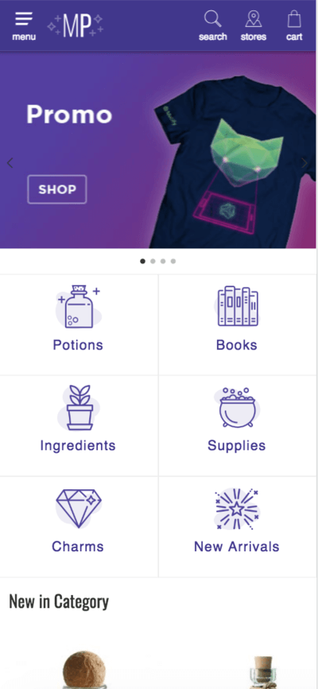
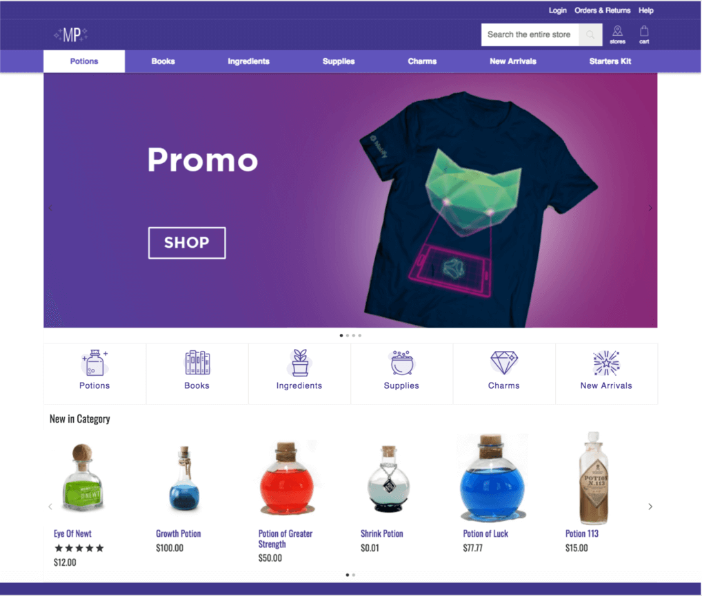

Released on September 27, 2018

## New features

### Progressive Web Apps

#### Responsive PWA Components (Early Access)
We've been hard at work at bringing the PWA experience to desktop screens. Available to early access customers and partners, PWA components across Home Page, Product Listing and Product Detail Pages have been updated to scale responsively to tablet and desktop screensizes. Early Access to using these components are available upon request.

Mobile            |  Tablet          |  Desktop
:-------------------------:|:-------------------------: | :-------------------: |
  |  | 

#### Lazy Loading Images
The [Image Component](https://docs.mobify.com/progressive-web/latest/components/#!/Image) has been enhanced with a new Lazy Loading flag that can be used to delay the loading of images until they are closer to the viewport. Lazy Loading offscreen images is important for performant image-heavy pages, such as Product Listing pages. Enabling this flag will decrease overall Time to Interactive metrics for these pages.

### Integrations

#### Commerce Integrations
Commerce Integrations is a new data layer that creates a natural break between the front-end experiences and the back-end systems that power them. Replacing the current [Integration Manager](https://docs.mobify.com/progressive-web/1.4.0/ecommerce-integrations/ecommerce-overview/) architecture, Commerce Integrations provides flexibility by standardising the API used across back-end systems. This means that you can freely update your customer facing site with a PWA or AMP without fear of having it be affected when it comes time to upgrade the back-end ecommerce solution.

<figure class="u-text-align-center">
    

        
    

    <figcaption>Commerce Integrations</figcaption>
</figure>

Commerce Integrations provide pre-built connectors to both Salesforce Commerce Cloud and SAP Hybris Commerce as well as a standard interface and utilities for implementing custom connectors to integrate with any ecommerce provider, such as IBM Watson Commerce, Oracle ATG & Commerce Cloud, Magento, and other in-house solutions.

As part of standardising the API that is used to pull data from the back-end ecommerce system, Commerce Integrations provides a full schema of methods and types that will be returned. This will make it significantly easier to implement than the previous Integration Manager.

Commerce Integrations introduces a number of changes designed to simplify the partner experience:

* New connectors are ordinary classes that implement a well-defined interface and return plain Javascript objects.
* It is possible to build extensions on any standard pre-built connectors as you would any other class. These act as building blocks that sit on top to cater for any custom changes a company may have built into their ecommerce platform setup.
* Commerce Integrations employs connectors that are unaware of the UI framework being used (e.g. React/Redux). This provides the flexibility to implement PWA or AMP, as well as the simplicity of introducing other touchpoints as well.

For more information, please see the [Commerce Integration Docs](https://docs.mobify.com/commerce-integrations/latest/)

## Enhancements

### Progressive Web Apps

#### Performance Manager Enabled by Default
Performance Manager was an early access addition to the SDK in the last release. For this release, we enabled Performance Manager by default. All projects can now take advantage of optimizations that bring down Time to Interactive metrics via Task Splitting, Download Management and deferring of lower priority work. [Detailed documentation](https://docs.mobify.com/progressive-web/latest/performance/) is available on how Performance Manager can be used within projects.

### Native Apps

#### Development Tool Upgrades
A key area of focus for Mobify's native app framework this release was to ensure that it stayed up to date with some of the newer and latest development tools. To that end, we've migrated from Google Cloud Messaging (GCM) to Firebase Cloud Messaging (FCM), upgraded to Node 8 and Webpack 4, and have added in support for Android API level 27.

GCM was recently [deprecated](https://developers.google.com/cloud-messaging/faq) in favor of FCM, and will be shut down by April 11, 2019. We took took the opportunity to get ahead of that timeline, and have now fully migrated to FCM.

In the May 2018 product release, PWA and AMP projects were upgraded to utilize [Webpack 4](https://medium.com/webpack/webpack-4-released-today-6cdb994702d4) which greatly reduces build times. Native app projects have been updated to also utilize Webpack 4, and app.js is seeing a 30% decrease in build times. Find more information on all the changes that come with Webpack 4 on their official [release notes](https://github.com/webpack/webpack/releases/tag/v4.0.0).

Google Play recently changed their [target API level requirements](https://developer.android.com/distribute/best-practices/develop/target-sdk). Google Play will require new app submissions to target at least Android API level 26 starting August 1st 2018, and app updates to target the same API level starting November 1st, 2018. To prepare for this new requirement, Mobify's native app framework has been updated to target and support Android API level 27.

An [upgrade guide](http://astro.mobify.com/latest/guides/extra/migrating-astro-v2/) is available for projects looking to upgrade to take advantage of these new updates.

## Known Issues

### Progressive Web Apps
* [Navigation component](https://docs.mobify.com/progressive-web/latest/components/#!/Nav) will throw an error if two or more children in the navigation tree have the same path.
* Service Worker support on iOS is disabled due to an outstanding Apple Safari bug introduced in iOS 11.4. Support will be re-enabled when a fix is deployed by Apple. Apple bug ID 40670799
* Errors appear in the browser console when Service Worker loads cached assets while Chrome is in Incognito mode

### Native Apps
* Back navigations will intermittently cause a brief flash on the screen before the apps content fully loads in.
* Apps with notches may not render as expected
* The account tab segmented control does not show up in iOS 12
* Account dashboard is unresponsive after user registers

## Fixes

### Mobify Preview
* When Mobify Preview and Mobify Cloud are both open in a browser, there is a chance that Mobify Preview cookies are accidentally overridden, which will cause Preview to drop back to the desktop site accidently. We’ve fixed this bug to provide a better first time user experience.

### Native Apps
* Addressed an issue where developers would not be able to dynamically update the header on navigations
* Removed unexpected content showing up within templates on Android
