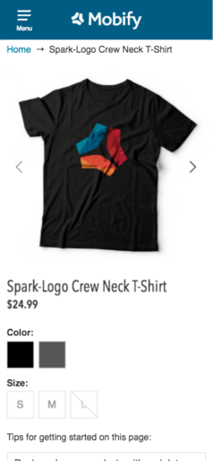
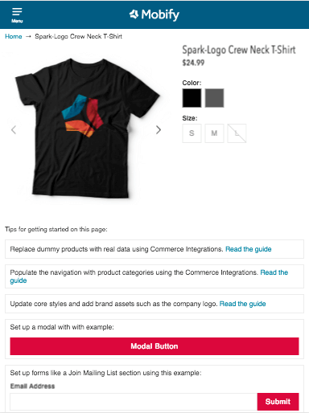
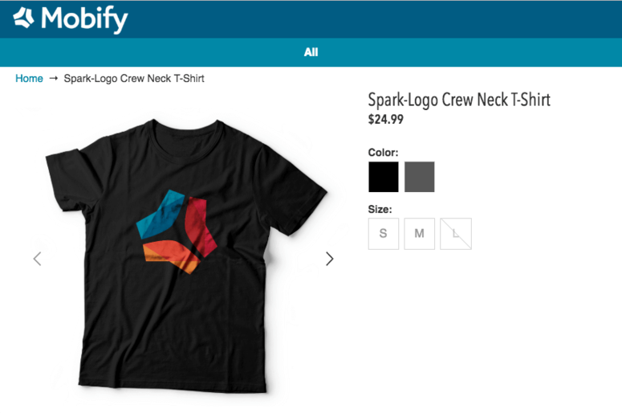

Released on January 10, 2019

## New features

### Mobify Test Framework

The [Mobify Test Framework](http://docs.mobify.com/mobify-test-framework/latest/) is a collection of Command Line Interface (CLI) utilities used to test PWA projects. It's a package of integrated testing tools utilized for end-to-end and performance testing PWAs. The framework utilizes both [Lighthouse](https://developers.google.com/web/tools/lighthouse/) and [Nightwatch](http://nightwatchjs.org/) to support these functions.

Previously, these tests existed within the platform scaffold. As a result of these tests, it wasn't easy for developers to easily adopt the latest versions of our tests as they were updated. Bringing these all together into one package should resolve this pain point.

### Universal Progressive Web Apps (Early Access)

#### New Scaffold

Based on feedback received, we've discovered that our current scaffold was too large, complex, and opinionated for our partner developers to leverage as a great starting point for their projects. Often times we've heard developers would be working backwards just to get the scaffold into a workable state. Our goal with the scaffold is to provide our developers with the best possible starting point to kick start their project.

We've heard and taken your feedback into account, and have created a new scaffold for developers to kick start their Universal Progressive Web App projects. Available now for early access partners and customers, key differences to note with our new scaffold include:

* Ships with a very light weight homepage, product listing page, and product detail template. This should prevent developers from having to work backwards to get to a workable state to start their project
* Ships with a new service worker library, [Workbox](https://developers.google.com/web/tools/workbox/), replacing our old service worker and it's predecessor in [sw-toolbox](https://github.com/GoogleChromeLabs/sw-toolbox)
* Pre-integrated with the new [Commerce Integrations](https://docs.mobify.com/commerce-integrations/latest/) data layer and the new [Mobify Test Framework](http://docs.mobify.com/mobify-test-framework/latest/)

Mobile            |  Tablet          |  Desktop
:-------------------------:|:-------------------------: | :-------------------: |
  |  | 

Documentation for further information is available upon request.

#### CLI for Cloud Target Management

Another key feature for this release is a tool that allows partners to:
* List the Mobify targets attached to their project in Mobify Cloud
* Show details about a Mobify target attached to their project
* Show the progress of a publish to a target

This tool is available via an Early Access program and is expected to expand in functionality based on initial feedback.

#### Unsupported Browser Support

It is now possible to set a list of browsers that are unsupported by your website. This can be for any reason though is generally reserved for older browsers. This will allow you to set a page that shoppers will be redirected to if they happen to access your site using one of the listed browsers. We believe this will ensure a high standard of shopper experience, as shoppers with a browser that cannot have a smooth experience with our UPWA will be instead directed to a static page with upgrade information, rather than attempting to load an experience that will not work for them.

## Enhancements

### Universal Progressive Web Apps (Early Access)

#### Operational Metrics

As part of this release, we now have support for dashboards that provide real-time metrics for the systems that deliver your Progressive Web App. This feature will allow partners and customers to track the performance and health of the system and understand if there are any issues that are impacting the performance of the website.

#### Server Side Only Test Rendering

For partners developing with UPWA’s, it is now possible to test the rendering a web page without client-side rendering. This means that you will be able to see precisely how much content on the page is being delivered via Server Side Rendering to bots and browsers that don’t support JavaScript. We believe that to get the best results with UPWA you want as much of the page being served by SSR as possible and this tool will make it possible to check your progress in this area.

## Known Issues

### Progressive Web Apps
* [Navigation component](/progressive-web/latest/components/#!/Nav) will throw an error if two or more children in the navigation tree have the same path.
* Errors appear in the browser console when Service Worker loads cached assets while Chrome is in Incognito mode

### Native Apps
* Account dashboard is unresponsive on Android after user registers
* If a user is signed in from a previous session, the sign in / register tabs persists if you sign in again from App Onboarding
* Android devices with notches may not render as expected

## Fixes

### Progressive Web Apps
* Added type="button" to the [popover component](https://docs.mobify.com/progressive-web/latest/components/#!/Popover) trigger button to prevent forms from being submitted by accident
* Updated the [DangerousHTML](https://docs.mobify.com/progressive-web/latest/components/#!/DangerousHTML) component to properly open anchors in new tabs
* Removed usage of h1 elements in the [Search](https://docs.mobify.com/progressive-web/latest/components/#!/Search) component for SEO purposes
* Enhanced the [Search](https://docs.mobify.com/progressive-web/latest/components/#!/Search) component by adding a blur handler that deactivates the component when the user blurs out of the component and ensure clicking inside the Search component doesn't cause it to deactivate-then-reactivate
* Added a iconSize prop to enable changing the icon size of the [Stepper](https://docs.mobify.com/progressive-web/latest/components/#!/Stepper) component
* Updated the [IconLabel](https://docs.mobify.com/progressive-web/latest/components/#!/IconLabel) component to support button elements
* Migrated the [Card](https://docs.mobify.com/progressive-web/latest/components/#!/Card) and [LazyLoadContent](https://docs.mobify.com/progressive-web/latest/components/#!/LazyLoadContent) from the platform scaffold to the SDK

### Native Apps
* Scroll position will now properly be reset to it's original position after exiting an input field
