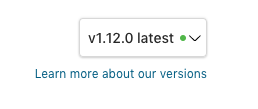

Released on September 26th, 2019 which corresponds to version `1.13.0` of our libraries.

In this release, we’ve made improvements to our Progressive Web App (PWA) Scaffold, PWA SDK, and Application Delivery Network (ADN), and we've resolved issues within our PWA SDK, Analytics Integrations, and Mobify Cloud.

## Features

### Progressive Web Apps (PWAs)

#### Experimental and deprecated feature tagging
We've introduced a tagging system to identify when developers are using experimental or deprecated features. Now, you'll see console warnings whenever a given feature is either experimental or deprecated.

<figure class="u-text-align-center">

  
  <figcaption>Feature tagging for experimental and deprecated features.</figcaption>

</figure>

#### Documentation updates
Look for our improved version picker, which includes the release dates for each version, plus a handy link to a new article that explains all about Mobify's versions.

<figure class="u-text-align-center">

  
  <figcaption>Find the new version picker at the top of our documentation site.</figcaption>

</figure>

## Updates

### Application Delivery Network (ADN)

#### Mobify API (Target Management) automatic pre-fill
We recognize that starting a new project and creating all the required targets can sometimes be difficult. As part of our desire to reduce friction for our partners, we've updated the [Target Management endpoint](../../../progressive-web/latest/guides/mobify-api/) so that users no longer need to fill out the entire form correctly to get a working target on the Mobify Platform.

With this update, creating a new target will only require the user to specify a `name` parameter. From there, we pre-fill the rest so that you don’t have to.

### PWA Scaffold
*Please note that PWA Scaffold changes only affect projects that are generated following this release. If there’s a feature you’d like to bring into your existing projects, please reach out to [Mobify Support](https://support.mobify.com/).*

#### Chunk size improvements
Moving forward, [Front-end Platform as a Service](https://www.mobify.com/front-end-as-a-service/) is now Mobify's default and only deployment option (note that existing tag-loaded projects are still supported). With that in mind, we've removed any PWA Scaffold code related to supporting our previous tag-loaded deployment option. This has resulted in a 25kb gzipped total chunk size reduction for the PWA Scaffold.

#### CSS code splitting
Note that we included CSS code splitting in this release originally. We decided to remove it following the release, to ensure compatibility with future product release plans.

## Bug Fixes

### PWA SDK
- Re-ordered the [SelectorRouter's](https://docs.mobify.com/progressive-web/latest/guides/routing/) `onChange` prop arguments from `nextState`, `prevState`, `replace`, `cb` to `prevState`, `nextState`, `replace`, `cb` which is the proper order in which they're received.
- Adjusted styling on the [`DebugInfo`](https://docs.mobify.com/progressive-web/latest/components/#!/DebugInfo) component so that it's properly fixed on pages and has an appropriately-sized tap target.
- Fixed an issue in which the [BazaarvoiceReview](https://docs.mobify.com/progressive-web/latest/components/#!/BazaarvoiceReview) component was intermittently failing to render.

### Analytics Integrations
- Fixed an issue in which the Google Analytics Connector failed to add the tracker name to the `addToCart` event.
- Fixed an issue in which the Google Tag Manager Connector was overriding the existing data layer. The connector will now conditionally define the data layer.

### Mobify Cloud
- Fixed an issue in which Mobify Cloud was incorrectly displaying the timestamp of the latest bundle deployment for all deployed bundles. The correct timestamps for when a bundle was deployed, and when it was initially created should now be shown.

### Application Delivery Network
- Fixed an issue in which URLs that contained Pipe Symbols (|) were failing to render, causing a 400 error instead. Pipe Symbols should no longer cause a disturbance to page loading.

## Known Issues

None!

<b>IN THIS RELEASE:</b>

