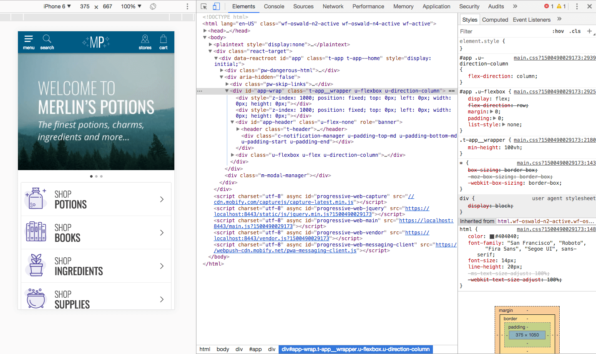

<div class="c-callout c--important">
  <p>
    <strong>Important:</strong> These instructions will <em>not</em> work with projects generated after November 2018, but we've left them here in case you still need to refer to them.
  </p>
  <p>
    The latest installation instructions can be found on our new <a href="../installation/">Installation</a> page.
  </p>
</div>

This guide will show you how to install and configure all the software you'll
need to start building a Progressive Web App (PWA) with the Mobify Platform.

## Required software <a name="required-software" href="#required-software">#</a>

If you haven't already, you'll need to install the following software:

* Git (usually preinstalled on Linux and Mac)
    * [For Linux](https://www.atlassian.com/git/tutorials/install-git#linux)
    * [For Mac](https://www.atlassian.com/git/tutorials/install-git#mac-os-x)
    * [For Windows](https://www.atlassian.com/git/tutorials/install-git#windows)
* Node Version Manager (nvm)
    * [For Linux or Mac](https://github.com/creationix/nvm#installation)
    * [For Windows](https://github.com/coreybutler/nvm-windows/releases)
* Node 10.17.0
    * To install with Node Version Manager, run `nvm install 10.17.0`
    * To install directly, [download the 10.17.0 release](https://nodejs.org/download/release/v10.17.0/) from the Node.js archive

**Windows users**: Always use the Git Bash terminal application that is
installed with Git for Windows to run any terminal commands that you see in our
documentation. Do *not* use Command Prompt (cmd.exe) or PowerShell.

## Recommended software <a name="recommended-software" href="#recommended-software">#</a>

We strongly recommend that you also install the following software:

* [Google Chrome](https://www.google.com/chrome/browser/desktop/index.html) and
  the following extensions:
    * [React Developer
      Tools](https://chrome.google.com/webstore/detail/react-developer-tools/fmkadmapgofadopljbjfkapdkoienihi?hl=en)
    * [Redux
      DevTools](https://chrome.google.com/webstore/detail/redux-devtools/lmhkpmbekcpmknklioeibfkpmmfibljd?hl=en)
* [Visual Studio Code](https://code.visualstudio.com/) from Microsoft and the
  [ESLint
  extension](https://marketplace.visualstudio.com/items?itemName=dbaeumer.vscode-eslint)
  from Dirk Baeumer.

## Project files <a name="project-files" href="#project-files">#</a>

Every project using Mobify's Progressive Mobile Web technology begins with a set
of project files, including:

* The Progressive Mobile Web Software Development Kit (SDK)
* A fully functional PWA for ecommerce based on a fictional store called
  [Merlin's Potions](https://www.merlinspotions.com)
* Open-source libraries
* A development server for previewing your work
* Scripts for automating common tasks, such as generating boilerplate code for
  pages and components

Most of the time, the project files will already be generated for you, and you
will need to ask someone from your team to give you access to them.

If you have been asked to generate the project files, please follow the
instructions in the [Generating a Project](../generating-a-project/) guide.

## Cloning a Mobify repository <a name="cloning" href="#cloning">#</a>

Once the project files have been generated, the files are usually kept in a
source code respository--often on GitHub.

Here's how to clone the GitHub repository that we use for our Mobify training
courses. The steps will be the same for any other GitHub repository.

1. Verify that you have been given access to the [pwa-training repository on
   GitHub](https://github.com/mobify/pwa-training). <br />(You will see a 404
   page until you have been given access to it by Mobify.)
2. Open a terminal window
3. Change to the directory where you want the project files to go
4. Run this command: `git clone https://github.com/mobify/pwa-training.git`

## Trusting Mobify's digital certificate <a name="avoiding-HTTPS-errors" href="#avoiding-HTTPS-errors">#</a>

Now that you've cloned or generated your project files, you need to configure
your system to trust Mobify's self-signed digital certificate. Otherwise, you
will see HTTPS errors in your browser that will prevent you from doing local
development.

Here's how to trust the certificate on different operating systems:

### Linux <a name="avoiding-HTTPS-errors-linux" href="#avoiding-HTTPS-errors-linux">#</a>

1. Open a Bash terminal
2. Run the following commands from the `web` directory inside your project
   directory:

```bash
#Install libnss3-tools for managing certs. (It's likely that these are already installed.)
sudo apt-get install libnss3-tools

#Add trust for dev webserver  self-signed SSL certificate
certutil -d sql:$HOME/.pki/nssdb -A -t "P,," -n dev-server/localhost.pem -i dev-server/localhost.pem
```

### macOS <a name="avoiding-HTTPS-errors-mac" href="#avoiding-HTTPS-errors-mac">#</a>

1. Open your terminal and go to the `web` directory inside your project
   directory
2. Run `open dev-server/localhost.pem`. *The Keychain Access app will open.*
3. Add the certificate to your **login** keychain
4. In the Keychain Access app, search for `Mobify Development Server`
5. Right click it and select **Get Info**
6. Expand the **Trust** section
7. Set **Secure Socket Layer (SSL)** to **Always Trust**
8. Close the info window. *You will need to enter your password.*

### Windows <a name="avoiding-HTTPS-errors-windows" href="#avoiding-HTTPS-errors-windows">#</a>

1.  Select **Start Menu → Run** and enter `mmc.exe`
2.  Select **File → Add/Remove Snap-in**
3.  Select **Certificates** and click **Add**
4.  Select **Computer Account** and click **Next**
5.  Select **Local Computer** and click **Finish**
6.  Click **OK** to close the **Add or Remove Snap-Ins** dialog
7.  Expand the **Certificates** node and right-click on the **Trusted Root
    Certification Authorities** node
8.  Select **All Tasks → Import**
9.  Import the `localhost.p7b` file in `web\dev-server\`. *Leave all other
     settings as is while importing.*
10. After clicking **Finish**, you should get an alert saying "The import was
    successful"
11. Exit the window. *You do not need to save the console settings, so click No
    when prompted.*

## Previewing your new project <a name="previewing-your-new-project" href="#previewing-your-new-project">#</a>

Before you can preview your project, you must run the following commands in a
terminal to install the Node packages that your project depends on. Substitute
the name of the directory that was cloned or generated for
`your-mobify-project-id` in the commands listed below. For example, if you
cloned the project files for a Mobify training course, the first command you'll
run will be `cd pwa-training`.

```bash
cd your-mobify-project-id
cd web
npm install
```

After the Node packages are installed, run the following command to start your
development web server:

```bash
npm start
```

Warning: Please make sure the digital certificate is configured correctly. You can verify it by opening https://localhost:8443 in Chrome, the security warning indicates the certificate has not been correctly configured.

Now that your development web server is running, look for the preview URL in
your terminal and copy it. (You may need to scroll up in your terminal history
to find the preview URL.)


For previewing your project during local development, we strongly recommend
using Google Chrome because of its accurate emulation of mobile devices and its
strong debugging tools.

Now that you've copied the preview URL, paste it into Google Chrome, but **don't
click the Preview button yet**. First, open the Chrome Developer Tools and choose a mobile device to emulate.

When you click the **Preview** button, a cookie will be created based on your user agent. If click the button without mobile emulation and switch to mobile emulation later, the new mobile user agent will not match the user agent recorded by the cookie. This will cause the PWA loading script to fail, and you will see the regular production website instead of your local PWA build. You can fix this by loading the preview URL again and clicking the button while in mobile emulation mode.


Now you're ready to hit the **Preview** button. The Merlin's Potions home page
will appear. (If it does not look like the screenshot below, see the
[troubleshooting](#troubleshooting) section at the end of this guide).

Now you can preview the changes to your project as you work!



## Troubleshooting <a name="troubleshooting" href="#troubleshooting">#</a>

### _If you encounter errors in your terminal while starting your development server:_ <a name="terminal-errors" href="#terminal-errors">#</a>

1. Run `node -v` from your terminal
1. Check that the version is `v10.17.0`. If you have a different version of Node
   installed:

  * Install Node Version Manager (nvm)
    * [For Linux or Mac](https://github.com/creationix/nvm#installation)
    * [For Windows](https://github.com/coreybutler/nvm-windows/releases)
  * Run `nvm install 10.17.0` or [download the 10.17.0 release](https://nodejs.org/download/release/v10.17.0/) from the Node.js archive
  * Delete your `node_modules` directory
  * Repeat the steps listed in [previewing your new
    project](#previewing-your-new-project)
  * Don't forget to check your Node version before running `npm install` again

### _If you see a blank, white screen while loading your PWA:_ <a name="white-screen" href="#white-screen">#</a>

1. Clear your cookies for `localhost` and `merlinspotions.com`
1. Go to the terminal running your development server
1. Press `control + c` to stop the development server
1. Run `npm start`
1. Copy the preview URL from the terminal output
1. Paste the URL into your browser
1. Emulate a mobile device using your browser's developer tools. **You must do this before the next step!**
1. Click the **Preview** button

### _If you see a purple header instead of a blue one or you see the desktop site instead of the PWA:_ <a name="purple-header-or-desktop" href="#purple-header-or-desktop">#</a>

1. Open Chrome’s DevTools
1. Go to application tab (in the DevTools window)
1. Click the **Clear site data** button
1. Verify that your local development server is running
1. Copy the Preview URL from the terminal again
1. Load the Preview URL (but don't click the **Preview** button yet!)
1. Emulate a mobile device using Chrome's DevTools
1. Click the **Preview** button
