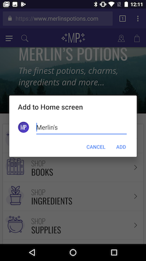
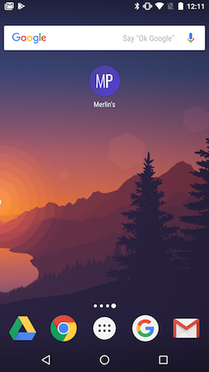
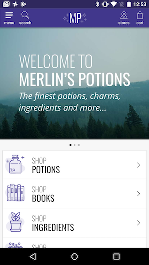
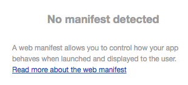

Add to Homescreen is a feature of Progressive Web Apps and is part of [Google's requirements for a PWA to be considered compliant](https://developers.google.com/web/progressive-web-apps/checklist#metadata-provided-for-add-to-home-screen).

## Prerequisites
* The `manifest.json` file is configured to match your brand
* Your project is served over HTTPS and no insecure assets are requested
* [The Service Worker is installed](../../getting-started/installing-the-service-worker/)

See the [full list of prerequisites](https://developers.google.com/web/fundamentals/app-install-banners/).

## Configuration
Add to Homescreen is enabled by default for all projects and will be configured to use the icon and theme color from [Merlin's Potions](https://www.merlinspotions.com/), our demo site.

To update the theme color, find the `theme_color` property in `web/app/static/manifest.json` and update it to match the color of your brand.

This setting only affects the PWA when launched from the home screen. To update the theme color shown when the app is used in browser, open `web/app/loader.js` and find this function call:

```js
loadAsset('meta', {
    name: 'theme-color',
    content: '#4e439b'
})
```

Update `content` to match your brand's theme color.

To update the icon, you can either update the icon file at `web/app/img/global/app-icon.png`, or you can change the src for the icon inside `web/app/static/manifest.json` to point to a different file.

*Note: At this time, if you update the icon file, you will only see this icon once the project has been published.*

## Testing

### On an Android device

#### Custom prompt or mini-infobar

1. Ensure that all [prerequisites](https://developers.google.com/web/fundamentals/app-install-banners/) for Add to Home Screen have been met. 

1. Tap the Add to Home Screen prompt. In this example, it is implemented as a button in the main nav. The mini-infobar is also present. To help with your implementation, we have this higher-order component, [AddToHomescreen](../../components/#!/AddToHomescreen).

	

1. In the official confirmation modal, choose **Cancel**. Verify that the confirmation modal is dismissed.

	

1. On the custom prompt, verify that it shows a message informing the user to refresh the page and try again.

	

1. Refresh the page

1. Tap the Add to Home Screen prompt again

1. In the official confirmation modal, choose **Add**

1. Minimize Chrome and verify that the app has been installed to the home screen. Launch the app from the home screen.

1. Open Chrome again and refresh the page. Verify that the Add to Home Screen prompt is no longer present.

#### Chrome menu option

When testing, you may not meet all the criteria for the prompt. The following instructions explain how to force the prompt to appear.

1. Preview to the site you are testing in regular browsing mode (incognito will not work)

1. Tap the ... menu button in Chrome

1. Tap Add to Home screen

1. Confirm the icon and default name and tap Add

   

1. Verify icon is on the home screen

   

1. Tap on the app and verify the PWA opens in standalone mode. The browser URL bar and other web-like chrome should be removed from the UI.

   

### In Chrome Dev Tools

1. Preview to the site you are testing in regular browsing mode (incognito will not work)
1. In the **Applications** tab, click on **Manifest**
1. Tap **Add to Homescreen**
1. There will be a browser permission prompt to add to applications launcher. Choose yes.
1. Open a new tab and browse to `chrome://apps/`. Verify that the app is listed.

## Debugging

The best way to debug issues with Add to Home Screen is to use Chrome Dev Tools and follow the [testing instructions](#testing-chrome). If the prompt doesn't appear after you tap **Add to Homescreen**, look in your console. On current versions of Android, an error will be logged explaining why the prompt didn't appear. On older versions like Android 5, the console will not include any error messages.

Common issues include:

* Insecure resources
* Delayed loading of manifest.json
* Missing manifest.json error
* Standalone mode showing desktop

### Insecure resources

If any resources on the page are loaded over HTTP instead of HTTPS, the browser will not show the Add to Home Screen prompt. This is often caused by images on the page.

### Delayed loading of manifest.json

If manifest.json is loaded too late, the browser may ignore it entirely. If this happens, try adding manifest.json to the beginning of the PWA initialization process. In most PWA projects, the following code loads manifest.json:

```js
// in loader.js

loadAsset('link', {
    href: getAssetUrl('static/manifest.json'),
    rel: 'manifest'
})
```

Try moving this code earlier in the `loadPWA` or equivalent function.

### Missing manifest.json error

When you click on **Manifest**, you may see an error stating "No manifest detected". If you see this error, close and reopen Chrome Dev Tools.



### Standalone mode showing desktop

This can occur when you are using Mobify Preview. Mobify Preview sets certain cookies that cause the Mobify Tag to load a specific bundle. Preview uses these cookies to create a Preview session. The Preview session also takes into account information about your browser like the user agent. While in a Preview session, you will see the PWA loaded from your bundle.

If you then open the standalone version of the app, you will have the Preview cookies but other properties about your browser have changed. This invalidates the Preview session. When the Preview session is invalidated, the desktop site will load instead of the PWA.

This is specific to Mobify Preview and will not occur on the production version of the site.

## FAQ

#### Q: Does this work on iOS?

A: No, this is an Android-only feature. 

However, as an alternative, you could implement a banner that instructs the users on how to add the app to the homescreen via the Share button. Please take a look at the [AddToHomescreenIosBanner](../../components/#!/AddToHomescreenIosBanner) component.

#### Q: What if the service worker loader is not yet installed?

A: Follow the steps for [Developing without the Mobify Requirements](../developing-without-the-mobify-tag/)

<div id="toc"><p class="u-text-size-smaller u-margin-start u-margin-bottom"><b>IN THIS ARTICLE:</b></p></div>
