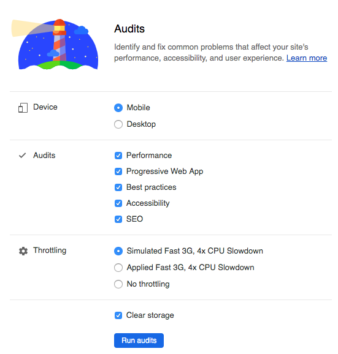
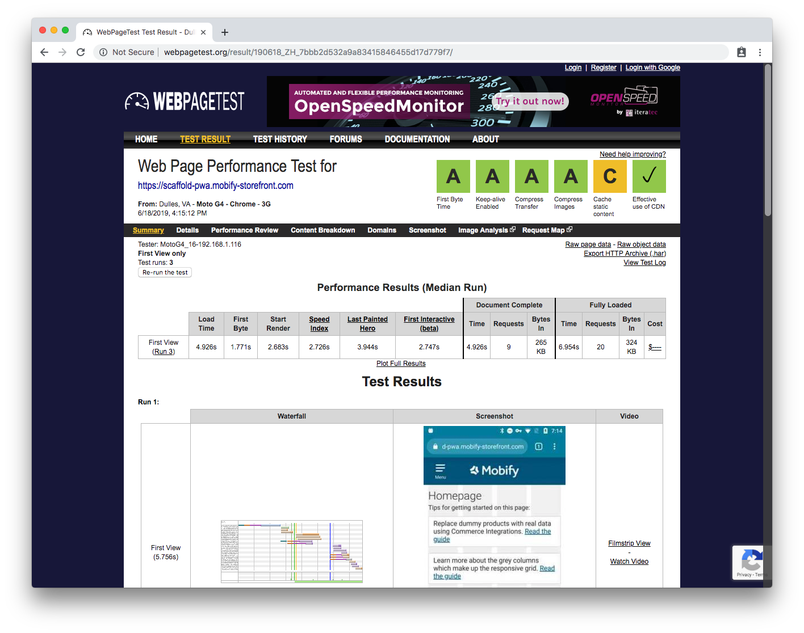
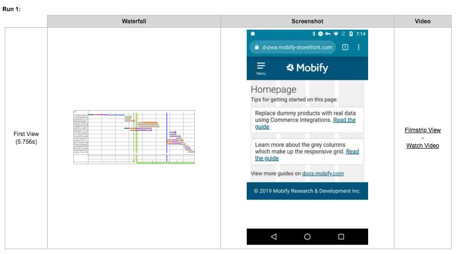
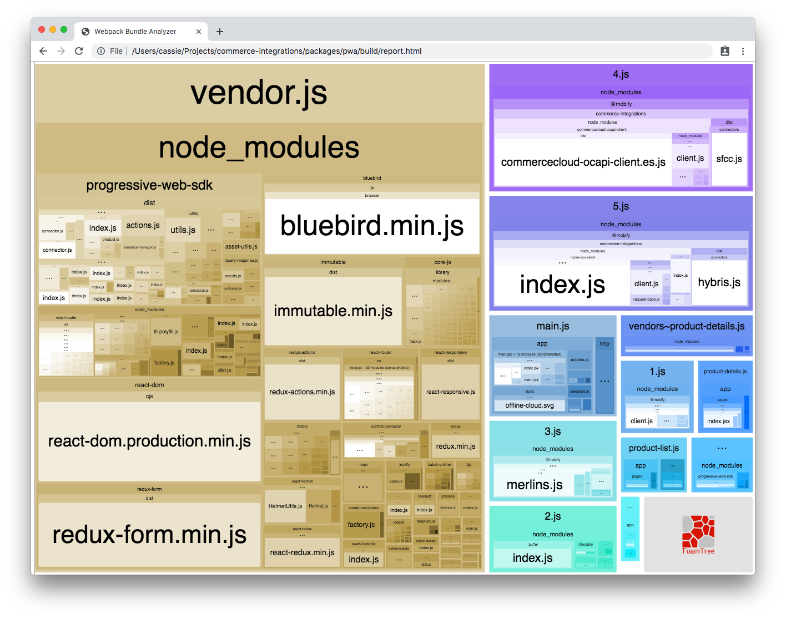

## Introduction

This document discusses techniques that you can use to build a highly performant Progressive Web App (PWA). We will focus on client-side performance: how the PWA loads and runs in the user’s browser. We'll also show you how to identify and resolve common client-side performance problems.

<div class="c-callout">
  <p>
    <strong>Note:</strong> If you’re seeking a guide on how to improve the performance of your server-side rendered PWA, you can find it in our article <a href="../ssr-performance-caching/">Building High Performing Server-Side Rendered PWAs with CDN and Persistent Caching</a>
  </p>
</div>

## Building a performant PWA

This guide will focus on recommendations for optimizing **network performance**. Issues with network performance have a much greater impact on PWA performance than any other issues. There are a variety of factors that influence the network performance of both server-side rendered and tag-loaded PWAs.

### Recommendations for tag-loaded PWAs

#### Prevent Asset Leaking

For tag-loaded PWAs, it’s important to be aware of an issue called “asset leaking”. This is when assets that are used on the desktop site are downloaded, even though they are not used by the PWA. Common examples are CSS files, JavaScript, and images. These assets compete for the network with critical PWA assets and affect the initial page load performance.

To avoid asset leaking, you will need to modify the desktop site. If the desktop site is maintained by another team of developers, try to recommend that they implement lazy loading of assets where possible. This will ensure that these assets will not be included in the initial request. This can often be done for images and for some JS files. Reducing the number of leaked assets can improve the initial page load performance significantly.

### Recommendations for all PWAs

#### Ordering of network requests

Often, the main culprits for poor network performance include making:

-   Non-essential network requests before critical network requests
-   Critical network requests too late
-   Critical network requests in _series_ instead of in _parallel_
-   Extra network requests

As a result, it's critical to consider not only _what_ you are requesting, but _how_ you are requesting it, and how it relates to other requests happening on the page. If your request ordering is optimized, you can load the same number of requests in much less time.

To do this, you will first need to review all of the requests that you are making when the page loads. What are the dependencies between these requests? What is the relative importance of each request?

Next, order these requests so that the most critical ones are made up front. Whenever possible, make requests in parallel. If requests are not critical, consider deferring them until after the page has finished loading by using the `callWhenQuiet` function of the [Performance Manager](../performance/).

To identify requests that are made in series, look for cases where promises are chained like so:

```js
return connector
    .getBasket()
    .then(() => connector.getCustomer())
    .then(() => connector.getContent())
```

When you find code like this, it's important to ask: do all of these requests need to be made one after another? You might find that you need to wait for all of the promises to complete, but the order that they execute in doesn't actually matter. In that case, you may be able to use [Promise.all](https://developer.mozilla.org/en-US/docs/Web/JavaScript/Reference/Global_Objects/Promise/all) instead. Promise.all allows you to wait for the result of several promises, without making the requests in series.

```js
return Promise.all([connector.getBasket(), connector.getCustomer(), connector.getContent()])
```

#### Lazy loading

Lazy loading allows content that is not critical for the initial page load to be loaded later on, at the time it becomes important or visible. Lazy loading helps improve your PWA’s performance by reducing the amount of data that is initially being requested and loaded, allowing the page to load faster while saving on bandwidth. A great example of a component that uses lazy loading is the [Image component](../../components/#!/Image) from the Mobify SDK. The Image component uses a placeholder graphic created with CSS. This means that the browser doesn’t need to request an image file to render the placeholder. When the image comes into view, the placeholder is replaced with the real image. For a look at lazy loading from a design perspective, please review the [Performant Product Loading Strategy](../../../../design/performant-product-loading-strategy/).

You can also apply the concept of lazy loading to third-party scripts. Scripts such as product reviews provide a good opportunity for this. Product reviews are often hidden from view when the product detail page first loads. The reviews might be below the fold, or they might be hidden inside an accordion. In either case, you can delay downloading and executing product review scripts until the reviews would be visible. This improves performance in two ways: it reduces the amount of data you need to load in order to render the page, and it means that the CPU isn’t busy executing the product review script when it could be executing scripts more critical to loading the page.

You can also lazy load some of the code responsible for creating the PWA. Most PWAs will use code splitting to separate the code for each page into a separate JavaScript file. These files are called “chunks”. You may want to pre-load the chunks for pages in the core user journey. This means that as the user navigates between pages in this core journey, each page renders instantly. Your PWA does not need to wait for the chunk to load in order to render the page. However, only a small subset of chunks should be preloaded. This helps prevent users from downloading chunks they may not need. For any chunks that you choose to preload, you can use the [Performance Manager](../performance/) to preload them when two conditions have been met: [the PWA has finished loading](../performance/#the-pwaquietevent-and-callwhenquiet) and the PWA is responsive to the user. This will ensure that preloading these chunks doesn’t interfere with the initial page load.

#### Client-side caching

When analyzing your network traffic, look for duplicated network requests. One way of eliminating these requests is by caching the response within your connector or within the redux store. (For more information about connectors, visit our [Commerce Integrations](../../integrations/commerce-integrations/) docs.)

For example, imagine that you wanted to reduce the number of requests to a `getProduct` API endpoint. Currently, whenever the user navigates to a product details page, the PWA makes a request to `getProduct`, even if the user was simply returning to a page they had already visited. In this case, you may want to cache the response for a particular product for a certain period of time. That way, if the user navigates back to the product while the response is still fresh in the cache, you avoid making another network request.

#### Avoid web fonts

Web fonts are custom fonts that must be downloaded by your PWA prior to being used. Generally, web fonts are loaded at the same time the app is being loaded. This means that the font is competing with other critical resources for bandwidth. Depending on the implementation, text may not render until the web font has loaded.

On slower networks, custom fonts can leave your users waiting. _On slow 3G networks, removing custom web fonts can improve your page load time by 1-2 seconds._ Whenever possible, use standard web fonts instead. These are fonts that are already supported on your users’ systems and don’t require an additional download.

#### Perceived performance

Performance goes beyond your site’s measured load and transition times. How the shopper _perceives_ the speed of your site is critical for engagement and conversion. Follow the principles discussed in the article, [Designing for the Appearance of Speed](https://www.mobify.com/insights/designing-appearance-speed/), in order to improve the perceived performance of your PWA. For a deep-dive on using interaction design to improve perceived site performance, read our [Designing App-Like Patterns](../../../../design/) series.

#### Optimized images

Providing the optimal image size for the device in use can help to reduce the amount of unnecessary information in the request. For example, when mobile devices request images at a higher resolution than they need, it adds additional request time and data which can slow down the PWA’s overall performance. Some content delivery networks (CDNs) allow for image resizing, which can help ensure images are well suited for the user's device, cutting down on redundant request time and data. Always leverage the CDN to serve an image that is appropriately sized for the user’s device.

SVG icons can sometimes contain unnecessary metadata, comments, and hidden elements. Removing any unnecessary metadata or comments from SVG icons can help reduce the file size of your SVG images. The [Icon component](../../components/#!/Icon) is designed to work with an SVG spritesheet, and the tools for generating and optimizing your spritesheet are built into your project’s starting point by default. To use it,

1. Place any SVGs you’d like to include in `app/static/svg/sprite-source`.
2. Run the command `npm run build-sprites` to optimize the SVGs and include them in a single spritesheet.
3. You’re done! Now those optimized SVGs can be rendered with the Icon component.

For more information, refer to the Lighthouse guide, [Optimize Images](https://developers.google.com/web/tools/lighthouse/audits/optimize-images).

## Evaluating PWA performance

A variety of tools can help you troubleshoot your PWA’s performance. This section will describe our recommended tools and their role in troubleshooting PWA performance issues.

### Lighthouse

[Lighthouse](https://github.com/GoogleChrome/lighthouse) is an auditing tool from Google that grades your PWA on performance, among other factors.


When running a performance audit, review the **Performance** section of the Lighthouse report. Typically, this section will contain a list of factors that are negatively impacting the performance of the PWA.

<div class="c-callout">
 <p>
   <strong>Note:</strong> Because of the caching behavior of tag-loaded PWAs, it's best to use the second Lighthouse test result as the most representative indicator of the PWA's performance. The second test will have a cached and gzipped response, which is what makes it a more representative indicator.
 </p>
</div>

Generally, Lighthouse will tell you whether there is a problem or not. You’ll need other tools to dig into _why_ there is a problem.

In order to get stable results, we recommend running Lighthouse as part of the continuous integration on a project. This can be set up using the [Mobify Test Framework](../../testing/mobify-test-framework/). If you must use Lighthouse without continuous integration, it’s a good idea to use the following settings under the **Audits** tab in **Chrome Developer Tools**:



### Web Page Test

Web Page Test (WPT) is a synthetic testing tool you can use to test how the PWA will load on a variety of devices.

In this section, we will cover:

-   Testing a tag-loaded PWA with WPT
-   Testing a server-side rendered PWA with WPT
-   Evaluating the results



#### Testing a tag-loaded PWA with WPT

To test the tag-loaded PWA production bundle for a live PWA, use the following settings:

-   Test location: Moto G (gen 4)
-   Browser: Moto G4 - Chrome
-   Connection: 3G
-   Number of tests to run: 3
-   First view only
-   Capture video

Web Page Test will then queue your request. After a few minutes, it will start revealing the results from the test.



To test non-production bundles which must be previewed, follow these instructions (or if you prefer, you can see a [video demonstration](https://www.youtube.com/watch?v=78wFMuG5DVU)):

-   Preview the bundle you wish to test
-   Copy the URL (including the parameters that preview added)
-   Paste that into the Website URL field on WPT
-   Under **Advanced Settings**, select the **Advanced** tab
-   Enter X-Mobify-Preview: 1 into **custom headers**
-   Run the test

This will force the bundle you are previewing to load for WPT. You may now evaluate the results.

<div class="c-callout">
  <p>
    <strong>Note:</strong> If you are testing a new bundle, make sure to run the test more than once, because the files are not compressed the first time you request the bundle.  You will likely encounter a longer than usual request time for main.js and vendor.js as a result. Running the test an additional time gives a more accurate result.
  </p>
</div>

#### Testing a server-side rendered PWA with WPT

Testing a server-side rendered PWA bundle is as simple as pointing WPT to the PWA’s domain. However, if the PWA target is configured with IP Whitelisting, then a few extra steps are required. If that’s the case for your project, follow these instructions:

1. Reach out to your Mobify Support Team and ask them to add `71.114.67.62/32` to the whitelisted IP addresses for your project.

    - This IP is the static address for the devices available from Dulles, VA. If you want to test in other regions, you will have to figure out those IPs. One way to find out an IP is to point [WPT at this Google search](https://www.google.com/search?q=what%27s+my+ip&oq=what%27s+my+ip&aqs=chrome..69i57j0j69i59j0l3.3479j0j1&sourceid=chrome&ie=UTF-8).

2. In WPT…
    - Copy the URL
    - Paste that into the **Website URL** field on WPT
    - Run the test

WPT will now be able to run its tests on the domain without any issues.

<div class="c-callout">
  <p>
    <strong>Note:</strong> At this time, it is not possible to test bundles that are not published to a target. Bundles must be published to a target and then tested. For more information on publishing bundles to a target, read our guide, <a href="../deploying-with-mobify-cloud/">Deploying with Mobify Cloud</a>.
  </p>
</div>

#### Evaluating the Results

Generally, most performance problems will arise from the network. This will be orders of magnitude slower than any issues arising from the device.

As you review the results, keep an eye out for the following sources of poor performance:

-   Early network requests for non-critical resources
-   Critical network requests that are made late
-   Critical network requests that are made in _sequence_ (rather than in _parallel_)
-   Too many network requests
-   Requests for things that are either really big or that load slowly. In terms of size, look out for JS files that are 500 Kb or larger. In terms of speed, look for a _time to first byte_ that’s greater than 2 seconds on a slow 3G network.

## Bundle Analyzer

[Webpack Bundle Analyzer](https://github.com/webpack-contrib/webpack-bundle-analyzer) can help you identify which modules are responsible for increasing the size of your project bundles. You can use it to examine which files and modules have been included in each of the files in your bundle.

By default, Webpack Bundle Analyzer is a command line tool that’s built into your project starting point. In most projects, you can run the tool using the following command:

```
npm run analyze-build
```

_If that doesn’t work, check your project’s `package.json` and verify that `analyze-build` is defined in your scripts. If it is not, reach out to Mobify Support for guidance on adding it._

You will see something like this:



Once you’re up and running, focus your attention on the files `loader.js`, `vendor.js` and `main.js`. Within those files, you can use the tool to look for dependencies that are either duplicated, located in the wrong place, or those that can be lazy loaded. Below we'll discuss each type of dependency in more detail.

#### Duplicated Dependencies

If you see two or more dependencies of the same name inside `vendor.js`, you’ve found a duplicated dependency.

One method for fixing this issue is updating your webpack configuration to use an alias. Use this alias to point all references made to the dependency to the same module in `node_modules`. This should look like `node_modules/dependency_name`.

For example, both `lodash` and `lodash-es` might be used by different dependencies of a project. This would mean that both versions would appear within `vendor.js`. You can use an alias to point all references made to `lodash` to the `lodash-es` version. This means that only `lodash-es` will be included in the project.

#### Dependencies that can be lazy loaded

Some dependencies are only used for some parts of the PWA. If this is the case, consider **lazy loading** the dependency.

You can do this by either lazy loading the component that imports the dependency (using [React-Loadable](https://github.com/jamiebuilds/react-loadable)) or by changing the import of the dependency to a [dynamic import](https://developer.mozilla.org/en-US/docs/Web/JavaScript/Reference/Statements/import#Dynamic_Imports).

#### Dependencies in the wrong place

This occurs most often with the file `loader.js`. For tag-loaded PWAs, it’s important to keep `loader.js` as small as possible, because it’s critical for your PWA’s performance. The `loader.js` file is the to load on the tag-loaded PWA, and nothing else can load until it’s complete. To ensure `loader.js` is fast, the number of dependencies for this file should be limited. However, sometimes dependencies are included accidentally. This happens most often when a utility file that is imported into `loader.js` also imports a dependency. In that case, the dependency is now included in `loader.js`, even if it is not used by `loader.js`.

For example:

-   `loader.js` imports `utils.js`
-   `main.js` imports `utils.js`
-   A new function is added to `utils.js` that uses `Immutable.js`
-   `Immutable.js` is now included in `loader.js`

To avoid this issue, we suggest that you separate utilities that are used in `loader.js` from utilities that the rest of the PWA uses.

## Next steps

After reading this guide, we hope you can identify, investigate, and resolve performance issues with your PWA.

If you are interested in reading more about conducting performance audits, read additional guides on performance such as [Auditing Performance](https://developers.google.com/web/fundamentals/performance/audit/) and [Progressive React](https://houssein.me/progressive-react). Or, explore how to build high-performing server-side rendered PWAs with our guide on [leveraging Mobify's CDN and Persistent Caching](../ssr-performance-caching/).

<div id="toc"><p class="u-text-size-smaller u-margin-start u-margin-bottom"><b>IN THIS ARTICLE:</b></p></div>