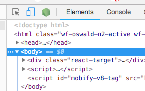

## Debugging the Local Server

During development you will likely run into times where you’ll need to debug your app as it runs on your local server. The local SSR server is built using [Node](https://nodejs.org/en/), so you can use the [Node inspector](https://nodejs.org/en/docs/guides/debugging-getting-started/) to debug it. 

For best results make sure you are on the latest version of Chrome (some Chrome versions have had inconsistent behaviour with the node inspector). 

In order to debug the Node server you’ll need to start your local server using a different command in your terminal. If you have a local instance of the SSR server already running, stop it and run the following command: 

```bash
npm run ssr:inspect 
```

Once the server is running you can open a dedicated DevTools window for your Node server through an open instance of the [Chrome DevTools](https://developers.google.com/web/tools/chrome-devtools/). If you have the Chrome DevTools open already in another tab, you will see a green Node icon appear in the top left corner of the DevTools window. Click on that icon to open a dedicated DevTools window for your node server.



If you have the Node inspector open aand you make changes to your app, the SSR server will rebuild and restart your app and the devtools will connect to the new process.

While running the node server in inspect mode you’ll be able to add debug statements or breakpoints to your app to see how your app is behaving during server side rendering. To prevent the app from hitting debug statements when it runs client side you may want to consider nesting them behind the `isServerSide` flag. 

```javascript
componentDidMount() {
        this.hidePreloaderWhenCSSIsLoaded()
        this.props.initializeApp()
        this.props.setInitialLocale()
        this.props.setStandAloneAppFlag()

        if (this.props.isServerSide) {
            // This debugger will only be hit when running on the local server
            debugger
        }

        //...
    }
```

It’s important to keep in mind that when your app runs server side it’s running within the context of JSDom. This means that stack traces for errors within the server side app will be slightly different from stack traces for errors that you would see running client side. This should only affect the bottom part of the stack, the top of the stack should be same server side as it is client side. 


