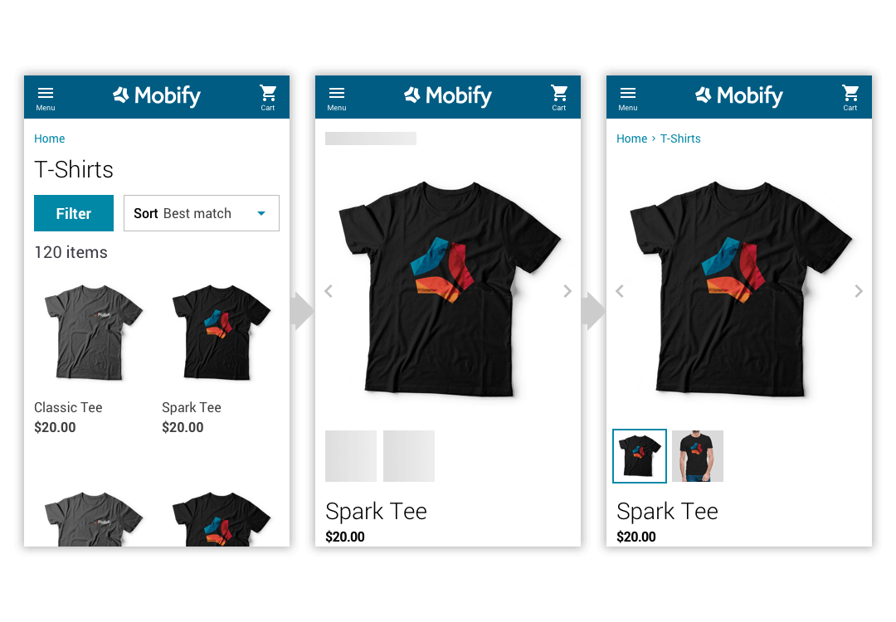
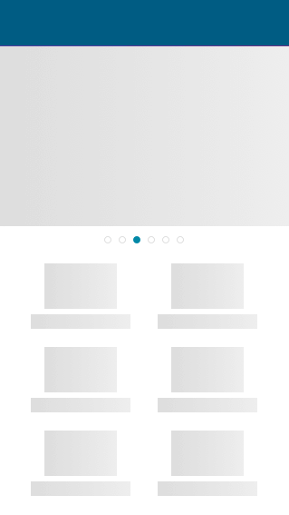

Instant page transitions are achieved when shared content from multiple pages in the PWA are rendered immediately, making the transition between pages feel instant and smooth.

<figure class="u-text-align-center" style="background-color: #fafafa;">


<figcaption>As you navigate from a product listing page to a product detail page, some information is unavailable and is replaced with placeholders.</figcaption>

</figure>

To further enhance the effect, you can use placeholders in the position of any content that requires more time to load. Think of placeholders as the building blocks to instant transitions and a tactic to improve users’ perceptions of page load speed. When implemented correctly, users will believe that the page is loading faster than it actually is.

## Core features

The core features of Instant Page Transitions include:

- Placeholders are shown while a new page is loading
- Content is immediately shown on previously-visited pages
- Content shared between pages is immediately shown

### Placeholders are shown while a new page is loading

When the user navigates to a new page for the first time, placeholders should be shown in place of any content that can't be rendered immediately. These placeholders should be the same size as the content they are replacing so that the page doesn't shift when the content can be rendered.

Let's walk through an example:

1. The user lands on your home page for the first time. The home page shows placeholders instead of content that still needs to be loaded.

<figure class="u-text-align-center" style="background-color: #fafafa;">


<figcaption>Home page with placeholders</figcaption>

</figure>

2. As the content loads on your home page, the placeholders are replaced with content.

<figure class="u-text-align-center" style="background-color: #fafafa;">


<figcaption>Fully-loaded home page</figcaption>

</figure>

This can be done by using placeholder components from the Mobify SDK. These include:

- [SkeletonBlock](../../components/#!/SkeletonBlock), which is used for larger chunks of information such as images or a cluster of text.
- [SkeletonInline](../../components/#!/SkeletonInline), which is used for inline pieces of content such as breadcrumbs.
- [SkeletonText](../../components/#!/SkeletonText), which is used for multiple lines of text such as paragraphs.

You can read more about placeholders in [Placeholder Design](../../../design/placeholder-design).

### Content is immediately shown on previously-visited pages

When the user navigates back to a page they previously visited, the page and all its contents should be rendered immediately. After the page is rendered, a request should be sent to check if anything has changed. If it has, the relevant parts of the page should be re-rendered.

Let's walk through an example:

1. The user is on your home page. All of the content has fully loaded, and no placeholders are shown.

<figure class="u-text-align-center" style="background-color: #fafafa;">


</figure>

2. The user navigates to your product listing page. Placeholders are shown until the content has loaded.

<figure class="u-text-align-center" style="background-color: #fafafa;">


</figure>

3. The user navigates back to your home page. Because all of the content has already loaded, no placeholders are shown.

<figure class="u-text-align-center" style="background-color: #fafafa;">


</figure>

In the project starting point, this is achieved using the redux store. When the page is first loaded, all of the content for the page is merged into the redux store. As long as this content remains in the redux store, it will be shown immediately when you navigate back to this page.

### Content shared between pages is immediately shown

When the user navigates to a page with some shared content (for example, transitioning from a product listing page to a product detail page), the shared content should be shown immediately, while placeholders should be shown in place of any content that can't be rendered immediately.

Let's walk through an example:

1. The user is on your product listing page. All of the content about the products has loaded including their image, name, and price.

<figure class="u-text-align-center" style="background-color: #fafafa;">


</figure>

2. The user navigates to a product detail page. All content that is shared between the product listing page and the product detail page is shown, such as the image, name, and price. Placeholders are shown in place of non-shared content.

<figure class="u-text-align-center" style="background-color: #fafafa;">


</figure>

3. The non-shared content finishes loading, replacing the placeholders.

<figure class="u-text-align-center" style="background-color: #fafafa;">


</figure>

In the project starting point, this is also achieved using the redux store. Both the product listing page and product details page access the shared content (the product image, name, and price) from the same location in the redux store. That way, when one page adds this content to the redux store, it is immediately accessible to the other page.

## Testing Instant Page Transitions

In Chrome DevTools, it's recommended to use the throttling options under the **Network** tab to slow 3G speeds. This is useful for seeing the page transitions and placeholder content loading frame by frame.

Verify the following:

1. Placeholder content renders and is styled correctly in the Core Retail Flow (Homepage -> PLP -> PDP) between page transitions. Content should load in after the placeholders and not jump.

1. Clicking the back button on the browser or navigating to a page that has been visited previously should be instant and not trigger placeholders.

1. Product data (such as image and price) should be loaded and instant when navigating from PLP to PDP.

1. Your PWA app header should be present at all times between transitions.

## Debugging Instant Page Transitions

#### What if the product image isn't shown immediately?

When navigating to a product detail page, the product's image should be shown immediately if it has previously been shown. If the image isn't shown immediately, one common cause is that the image's `src` is being modified inside the component where it's being rendered.

For example, let's say you have a product image with a URL of `https://www.example.com/images/123.jpg`. You can resize the image by using query parameters, so you use the URL `https://www.example.com/images/123.jpg?w=200&h=200` for the product thumbnails. You store `https://www.example.com/images/123.jpg` in the redux store, and update the `ProductTile` component to use the query parameters.

```js
// in components/product-tile/index.jsx
<Image src={`${src}?w=200&h=200`} alt="..." />
```

You want to show the full size image on the product details page, so you don't include the query parameters.

```js
// in containers/product-details/product-details-carousel.jsx
<Image src={src} alt="..." />
```

However, this means that the `ProductTile` and the `ProductDetailsCarousel` are always referencing different versions of the image. Even though the product image was already requested for `ProductTile`, `ProductDetailsCarousel` can't immediately render it. Because it has a different URL, it must be requested separately.

To fix this issue, modify the `src` of the image within your parser or commands, rather than inside the component. This ensures that the already modified version is added to the store, where it can be used in both places.

<div id="toc"><p class="u-text-size-smaller u-margin-start u-margin-bottom"><b>IN THIS ARTICLE:</b></p></div>
